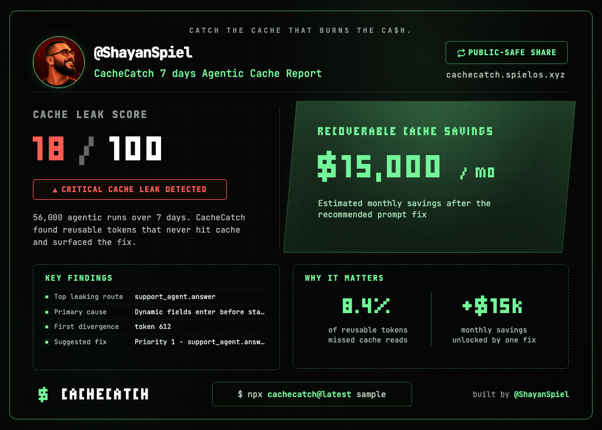

# Cachecatch

**The first prompt-cache audit and optimization tool for AI agents.**

Create your agentic CacheCatch report + your 𝕏 banner, [flex it right now ↗︎](https://cachecatch.spielos.xyz/)
[](https://cachecatch.spielos.xyz/#heroCta)


Cachecatch was built because we couldn't find a proper cache report on our own observability traces. Nobody else was doing this. So we built it.

Prompt-cache leaks are silent money burns. Stable instructions, tools, policies, and examples get billed like fresh input whenever request-specific data appears too early in the prompt. That shows up as low cache-read tokens, higher latency, and avoidable model spend — at scale.

Cachecatch audits your agent traces, finds prompt-cache breakers, estimates recoverable spend, and gives you exact fixes.

**Run your first report now — it takes 30 seconds:**

```bash
npx cachecatch@latest audit local --window 7d
```

Your report ends with a shareable X banner. Post it, show your team what cache costs you.

---

## Two reports. One tool.

Cachecatch covers both worlds:

| Report | For who | What it audits |
| --- | --- | --- |
| **Local IDE Agent** | Individual developers | Claude Code, Codex, OpenCode session transcripts on your machine |
| **Platform Trace** | Teams running production agents | LangSmith, Langfuse, Braintrust traces across routes and runs |

Same engine. Same `CachecatchReport` schema. Same X banner.

---

## Local IDE Agent Report

Audit your local coding agent sessions — no API key, no network, no config:

```bash
npx cachecatch@latest audit local --window 7d
```

What it shows:
- Agentic sessions parsed, token activity, tool calls, subagent runs
- Cache read profile when exact cache-token telemetry is present
- Context hygiene score (volatile data near prompt prefix)
- Recoverable cost estimate
- IDE agents used (Claude Code, Codex, OpenCode)

Expand the window for fuller picture:

```bash
npx cachecatch@latest audit local --window 30d
npx cachecatch@latest audit local --window 30d --json ./local-report.json
```

Scope to one repo:

```bash
npx cachecatch@latest audit local --project /path/to/repo --window 7d
```

### Why some agents show cache telemetry and others do not

Local IDE agents expose different levels of local data:

- OpenCode exposes local token/cache telemetry directly, so Cachecatch can report observed cache-read percentage from local fields.
- Codex can expose token/cache fields through local JSONL token events and future OTel logs depending on version/config.
- Claude Code can expose usage, cost, cache, and tool telemetry through OTel when enabled.
- Cursor and some other IDEs may only expose transcript/context history.

Cachecatch separates visibility into exact cache telemetry, token telemetry only, transcript context only, and unavailable. It never treats missing cache telemetry as zero, never invents cache-read percentage, and never invents cost upside when the model/pricing/token basis is missing.

Enable future Codex telemetry:

```bash
npx cachecatch@latest init codex
npx cachecatch@latest daemon
codex
npx cachecatch@latest audit local --window 7d
```

Enable future Claude Code telemetry:

```bash
npx cachecatch@latest init claude
source ~/.cachecatch/claude-code-otel.env
npx cachecatch@latest daemon
claude
npx cachecatch@latest audit local --window 7d
```

Debug local telemetry visibility without printing raw prompts:

```bash
npx cachecatch@latest debug codex-telemetry
npx cachecatch@latest debug claude-telemetry
npx cachecatch@latest telemetry status
```

---

## Platform Trace Report

Audit production agent traces from LangSmith, Langfuse, or Braintrust:

```bash
npx cachecatch@latest audit "your-project" --provider langsmith --window 7d
```

What it shows:
- Traces analyzed, routes detected, cache-read rate
- Estimated recoverable cache loss ($)
- Top leaking routes with exact fix instructions
- Prompt layout issues (what's breaking prefix stability)

See which projects your key can access:

```bash
npx cachecatch@latest projects --provider langsmith
```

Set the key once in your shell:

```bash
export LANGSMITH_API_KEY="lsv2_..."
npx cachecatch@latest audit "your-project" --provider langsmith --window 7d
```

Langfuse:

```bash
export LANGFUSE_PUBLIC_KEY="pk-lf-..."
export LANGFUSE_SECRET_KEY="sk-lf-..."
npx cachecatch@latest audit "your-project" --provider langfuse --window 7d
```

Or pass the key directly:

```bash
npx cachecatch@latest audit "your-project" --provider langsmith --window 7d --key "$LANGSMITH_API_KEY"
```

---

## Why Token Spend Matters

Cache-read tokens cost a fraction of input tokens. When your prompt assembly is unstable — timestamps, request IDs, or user data appearing before stable instructions — the provider sees every request as unique. You lose the cache discount entirely.

At production scale, that's real money. Cachecatch finds the exact tokens that are breaking your cache prefix and tells you where to move them.

---

## Sample (No API Key)

Run a realistic demo report with no network access:

```bash
npx cachecatch@latest sample
npx cachecatch@latest sample --compact
npx cachecatch@latest sample --full
npx cachecatch@latest sample --explain-math
npx cachecatch@latest sample --out ./cachecatch-report.html
```

---

## Export to HTML

```bash
npx cachecatch@latest sample --json > audit.json
npx cachecatch@latest export audit.json --format html --out ./cachecatch-report.html
```

Or directly from a report:

```bash
npx cachecatch@latest sample --out ./cachecatch-report.html
```

---

## Share on X

Every report generates a shareable X banner. Post it to show your cache status:

```bash
npx cachecatch@latest share --handle @yourname
```

This fetches your X profile picture, renders a 1024x732 banner with your audit data, and saves it as `cachecatch-x-share.png`. Ready to attach to a post.

From a saved report:

```bash
npx cachecatch@latest share audit.json --handle @yourname -o ./my-card.png
npx cachecatch@latest share local-report.json --handle @yourname -o ./my-local-card.png
```

---

## Supported Providers

| Provider | Status | Credentials |
| --- | --- | --- |
| LangSmith | Primary | `LANGSMITH_API_KEY` |
| Langfuse | Covered | `LANGFUSE_PUBLIC_KEY` + `LANGFUSE_SECRET_KEY` |
| Braintrust | Covered | `BRAINTRUST_API_KEY` |

---

## CLI Commands

| Command | Purpose |
| --- | --- |
| `cachecatch` | Show quick start |
| `cachecatch sample` | Render a deterministic sample report |
| `cachecatch sample --compact` | Short executive summary |
| `cachecatch sample --full` | Full route diagnostics |
| `cachecatch sample --json` | Raw `CachecatchReport` JSON |
| `cachecatch sample --out ./report.html` | Export sample as HTML |
| `cachecatch audit local --window 7d` | Scan local Claude Code, Codex, OpenCode sessions |
| `cachecatch audit local --project /path/to/repo --window 7d` | Restrict local audit to one repo |
| `cachecatch debug codex-telemetry` | Inspect Codex local telemetry fields without raw prompts |
| `cachecatch debug claude-telemetry` | Inspect Claude Code local telemetry fields without raw prompts |
| `cachecatch init codex` | Configure Codex OTel to the local Cachecatch daemon |
| `cachecatch init claude` | Write a safe Claude Code OTel env file |
| `cachecatch daemon` | Receive local OTLP logs/metrics on localhost |
| `cachecatch telemetry status` | Show daemon/config/event visibility |
| `cachecatch run claude` | Launch Claude Code with the generated telemetry env |
| `cachecatch audit "project" --provider langsmith --window 7d` | Run a live platform audit |
| `cachecatch audit "project" --json` | JSON output for automation |
| `cachecatch projects --provider langsmith` | List projects visible to a provider key |
| `cachecatch config set-key langsmith <key>` | Save provider key to local `.env` |
| `cachecatch config set-key langfuse publicKey:secretKey` | Save Langfuse keys |
| `cachecatch config get` | Show redacted local config |
| `cachecatch export audit.json --format html --out ./report.html` | Convert saved report JSON to HTML |
| `cachecatch share --handle @yourname` | Generate a shareable X card PNG |
| `cachecatch --help` | Show CLI help |

All report commands support `--no-color` for plain terminal output.

---

## Requirements

- Node.js 18+
- An observability provider API key for platform audits
- Rendered prompts and token usage in traces for high-confidence platform reports

---

## Privacy

- Runs locally from your terminal.
- Does not store prompts, traces, or reports unless you explicitly write an output file.
- Reads API keys from flags, environment variables, or a local `.env`.
- Does not log API keys.
- The OTel daemon binds to localhost by default and does not send data anywhere external.
- Codex setup uses `log_user_prompt = false`.
- Claude setup does not enable user prompts, assistant responses, tool content, or raw API bodies by default.
- Claude tool details are opt-in with `npx cachecatch init claude --include-tool-details`.
- Raw OTLP bodies are not stored unless you explicitly run `npx cachecatch daemon --debug-raw`.
- The web app path audits server-side; the browser only receives the generated report.

---

## Development

```bash
npm install
npm run build
npm run lint
npm test
npm run test:live
npm run cachecatch -- sample
```

| Script | Purpose |
| --- | --- |
| `npm run dev` | Start the Next.js web app |
| `npm run build:cli` | Compile the CLI to `dist/index.js` |
| `npm run build` | Build CLI and web app |
| `npm run typecheck` | Run TypeScript checks |
| `npm run lint` | Run ESLint |
| `npm test` | Run engine, adapter, HTTP plumbing, and CLI tests |
| `npm run test:live` | Run live provider smoke tests when real keys are set |
| `npm run cachecatch -- sample` | Run the local CLI |

---

## Architecture

```text
src/
  bin/        CLI entry point and commands
  adapters/   LangSmith, Langfuse, Braintrust, and mock provider I/O
  engine/     Provider-agnostic trace analysis plus local IDE session audit
  reporting/  Terminal, HTML, and X card renderers
  types/      Shared CachecatchReport and NormalizedTrace types
  util/       HTTP and environment helpers
```

The CLI and web app share the same engine and `CachecatchReport` schema. Provider-specific HTTP code stays in `src/adapters/*`; cache analysis stays provider-agnostic in `src/engine/*`. Local IDE agent scanning is implemented in `src/engine/local-agent-audit.ts` and produces a `LocalAgentReport`. X card banners are generated from `src/reporting/x-card.ts` or `src/reporting/x-card-local.ts` (HTML templates) and `src/reporting/html-to-png.ts` (Puppeteer screenshot).

---

## Troubleshooting

### Missing project

```bash
npx cachecatch@latest audit "your-project-name" --provider langsmith --window 7d
```

Use `projects` if you are unsure which names your key can see.

### Missing API key

```bash
export LANGSMITH_API_KEY="lsv2_..."
```

Langfuse:

```bash
export LANGFUSE_PUBLIC_KEY="pk-lf-..."
export LANGFUSE_SECRET_KEY="sk-lf-..."
```

### No trace data found

Try a wider window:

```bash
npx cachecatch@latest audit "your-project-name" --provider langsmith --window 30d
```

Confirm that your traces include rendered prompts and LLM token usage.

### Export says no report JSON was provided

```bash
npx cachecatch@latest sample --json > audit.json
npx cachecatch@latest export audit.json --format html --out ./cachecatch-report.html
```

### JSON output for CI

```bash
npx cachecatch@latest sample --json > audit.json
```

No spinner or status text is printed in JSON mode.

---

## License

MIT
